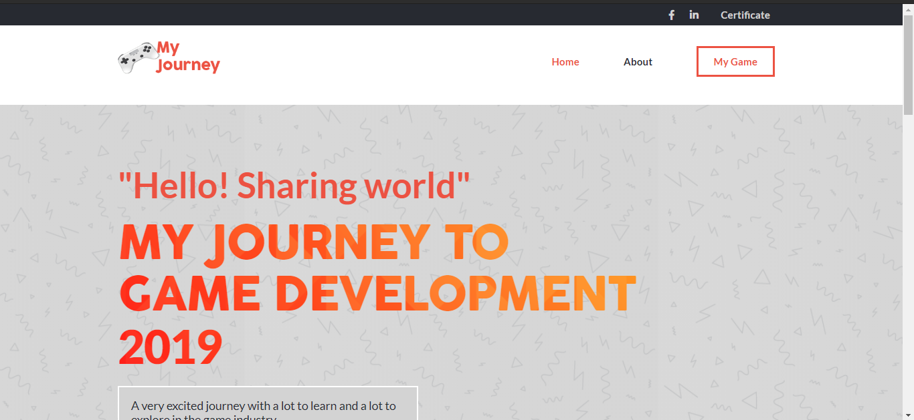
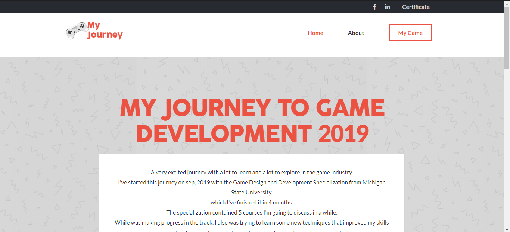
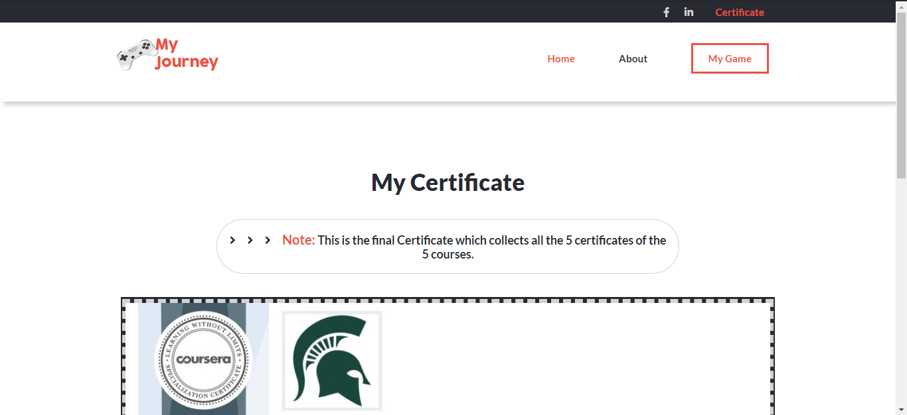
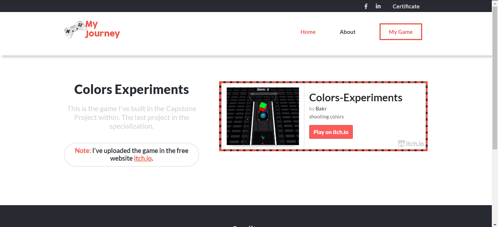

# Capstone-Project
This is the HTML &amp; CSS Capstone Project

**My Journey To Game Development as a topic has been published briefly in this website which contained 4 html files (home, about, certificate and my game) pages with 4 css files (one for each page)**

## Built With

- HTML
- CSS3

[Live Demo Link](https://xenodochial-tereshkova-e00530.netlify.app/)

**Design idea by [Cindy Shin in Behance](https://www.behance.net/adagio07)**

## Getting Started

**1) Clone this Github repository.**
**2) Create a branch with the name of main changes.**
**3) Create a pull request for these changes.**

## Authors

👤 **Mahmoud Bakr**

- Github: [@MahmoudBakr23](https://github.com/MahmoudBakr23)
- LinkedIn: [Mahmoud Bakr](https://www.linkedin.com/in/mahmoud-bakr-a76323194/)
- Gmail: mbakr6821@gmail.com

## 🤝 Contributing

Contributions, issues and feature requests are welcome!

## Show your support

Give a ⭐️ if you like this project!